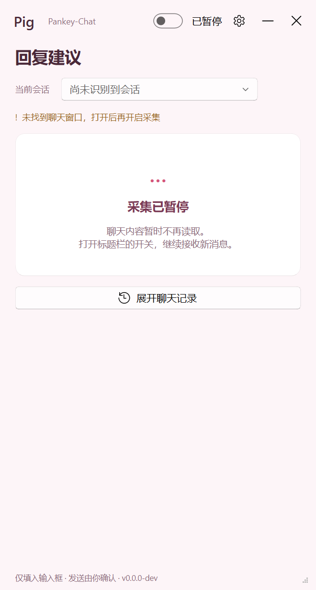

# 猪头军师 (PigTou JunShi)

微信聊天回复辅助工具 —— 读到对方消息，本地 AI 判断风险，狗头军师深度推演利弊，给你 3 条候选回复，你选一条填入微信输入框，**发送永远手动**。

## 截图



## 特点

- **零 API 成本**：本地 Laya 模型做风险初判，本地 qwen2.5:7b 起草回复，不花一分钱
- **狗头军师模式**：不是机械回复，按"稳健 / 策略 / 边界"三个方向推演利弊
- **不碰微信进程**：只截图 + 本地 OCR，不 hook、不注入、不读数据库
- **粉色 UI**：干净的悬浮窗，不打扰

## 下载

去 [Releases](../../releases) 下载 `zhutou-junshi-v1.0.0.zip`，解压后运行 `猪头军师.exe`。

## 首次使用

### 1. 安装 Ollama（本地起草模型）

下载安装：https://ollama.com/download

安装后拉取模型（约 3.8GB）：

```
ollama pull qwen2.5:7b
```

### 2. 启动猪头军师

双击 `猪头军师.exe`，打开微信窗口，在悬浮窗开启采集开关即可。

### 3. 首次等待模型下载

Laya 判断模型（约 1.4GB）首次运行时自动从 HuggingFace 下载，需等待。

## 系统要求

- Windows 10/11 64位
- 内存 8GB 以上（推荐 16GB）
- 硬盘空间 5GB（程序 1GB + 模型 5GB）
- 不要求独立显卡（CPU 也能跑，稍慢）

## 配置说明

| 配置项 | 默认值 | 说明 |
|--------|--------|------|
| 判断模型 | 本地 Laya | 离线免费，自动下载 |
| 起草模型 | qwen2.5:7b | 通过 Ollama 本地运行 |
| 军师模式 | 开启 | 利弊推演 + 三版本回复 |

也可以在设置里把起草模型换成云端 API（DeepSeek / OpenAI 等），填入对应 base_url 和 key。

## 工作原理

```
微信消息 → 截图 OCR → Laya 本地风险初判
                    ↓
              qwen2.5:7b（Ollama 本地 GPU）→ 狗头军师利弊推演
                    ↓
              3 条候选（稳健/策略/边界）→ 填入微信输入框 → 人工确认发送
```

## 免责声明

本工具仅辅助你组织语言，所有回复均需你确认后手动发送。不对聊天内容负责。
